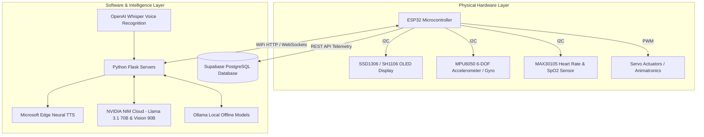

# 👑 King - Engineering & Hardware Portfolio

<p align="center">
  
  
  
  
</p>

Welcome to the **King** repository—a unified monorepo showcasing a comprehensive collection of embedded hardware systems, IoT wearable tech, generative AI voice assistants, and robotics developed by **Himank Bhumarkar (HIMANK9506)**.

---

## 📑 Table of Contents

- [Overview & Architecture](#-overview--architecture)
- [Project Catalog](#-project-catalog)
  - [🤖 AI Voice Assistants & Agents](#-ai-voice-assistants--agents)
  - [🐾 Embedded AI Companions & Cyber-Pets](#-embedded-ai-companions--cyber-pets)
  - [⌚ Smart Wearables & IoT Sensor Systems](#-smart-wearables--iot-sensor-systems)
  - [📚 Shared Hardware Libraries](#-shared-hardware-libraries)
- [Technology Stack](#-technology-stack)
- [Quick Start Guide](#-quick-start-guide)
- [Author & License](#-author--license)

---

## 🏛️ Overview & Architecture

The projects span the bridge between physical silicon and cloud/local artificial intelligence:



---

## 📂 Project Catalog

### 🤖 AI Voice Assistants & Agents

| Project | Description | Key Tech |
| :--- | :--- | :--- |
| [**J.A.R.V.I.S_1**](./J.A.R.V.I.S_1) | Generation 1 Iron Man inspired assistant with an animated HUD and streaming voice responses. | Python, Flask, NVIDIA NIM, Edge-TTS |
| [**J.A.R.V.I.S_2**](./J.A.R.V.I.S_2) | Generation 2 assistant with enhanced persona prompts, low-latency audio chunks, and improved HUD. | Python, Flask, NVIDIA NIM, Edge-TTS |
| [**J.A.R.V.I.S_3**](./J.A.R.V.I.S_3) | **Flagship Assistant**: Dual Online (NVIDIA) & Offline (Ollama) mode, Multimodal Vision, Code Execution Sandbox, SDXL-Turbo Image Generation. | Flask, Ollama, NVIDIA NIM, SDXL, Code Runner |
| [**ordeio**](./ordeio) | Minimalist voice-first multimodal executive AI workspace. | Flask, NVIDIA NIM, Edge-TTS |
| [**ordio2**](./ordio2) | AI workspace upgraded with persistent SQLite conversation history (`ordio.db`) and session navigation. | Flask, SQLite, Edge-TTS |
| [**ordio3**](./ordio3) | Multimodal productivity power-hub: YouTube video transcript analyzer & summarizer, live web scraper, and multi-session database. | Flask, SQLite, YouTube API, Web Scraper |

### 🐾 Embedded AI Companions & Cyber-Pets

| Project | Description | Key Tech |
| :--- | :--- | :--- |
| [**BuddyESP32**](./BuddyESP32) | Embodied AI Companion: Real-time physical robot with animated OLED facial expressions, servo head movement, and a Python AI Whisper brain. | ESP32, Servos, Whisper, Flask, Edge-TTS |
| [**CutieCat_Mini**](./CutieCat_Mini) | Wearable pocket virtual cat featuring procedural blinking animations, live NTP clock, and real-time WiFi network scanner. | ESP32, SSD1306 OLED, NTP Time, WiFi API |
| [**NekoAI**](./NekoAI) | ESP32 Tamagotchi pet: Hunger & happiness state machine, MPU6050 pedometer (walking cheers up your pet), and OLED arcade mini-games. | ESP32, U8g2, MPU6050, Button Input |
| [**V2**](./V2) | CatAI V2: Modular architecture featuring non-volatile EEPROM state persistence, piezo buzzer audio sound effects, and hierarchical UI menus. | ESP32, EEPROM, Piezo PWM, U8g2 |
| [**V3**](./V3) | CatAI V3: High-efficiency engine tuned for minimal RAM overhead and smooth 60 FPS animation routines. | ESP32, U8g2, Optimized Framebuffers |

### ⌚ Smart Wearables & IoT Sensor Systems

| Project | Description | Key Tech |
| :--- | :--- | :--- |
| [**sketch_jul16a (CyberWatch)**](./sketch_jul16a) | Full-featured ESP32 Smartwatch: Continuous Heart Rate & SpO2 monitoring (MAX30105), step counter (MPU6050), playable Chrome Dino game, and Supabase cloud sync. | ESP32, MAX30105, MPU6050, Supabase, FreeRTOS |
| [**IOT_gesture-project**](./IOT_gesture-project) | Real-time 6-DOF hand motion tracker with serial sensor streaming and 3D visualizers in Python (OpenGL/Pygame) and Processing. | ESP32, MPU6050, Python 3D, Processing |

### 📚 Shared Hardware Libraries

The [**libraries/**](./libraries) directory contains optimized and compatible C++ drivers used across the microcontroller sketches:
- `Adafruit_GFX`, `Adafruit_SSD1306`, `Adafruit_BusIO`
- `MPU6050`, `MPU6050_light`
- `SparkFun_MAX3010x_Pulse_and_Proximity_Sensor_Library`
- `U8g2` (High-performance monochrome display library)
- `ESPAsyncWebServer`, `AsyncTCP`
- `ArduinoJson`, `Preferences`

---

## 💻 Technology Stack

### Hardware & Microcontrollers
- **Core Processors**: ESP32 Dual-Core Tensilica Xtensa 32-bit LX6 @ 240 MHz
- **Displays**: Monochrome OLEDs (SSD1306, SH1106, 128x64 I2C)
- **Sensory Peripherals**: MPU6050 (6-Axis IMU), MAX30105/MAX30102 (Optical Biometric PPG Sensor)
- **Actuators & Audio**: Micro Servos (SG90), Piezo Buzzer PWM sound synthesis

### Software, AI & Cloud
- **Firmware**: C++ (Arduino Framework, ESP-IDF)
- **Backend**: Python 3.10+, Flask, Asyncio, Requests, Subprocess Sandbox
- **Language Models**: Meta Llama 3.1 70B & 8B (via NVIDIA NIM), Llama 3.2 90B Vision, Local Ollama
- **Speech & Audio**: OpenAI Whisper (Speech-to-Text), Microsoft Edge TTS (`RyanNeural`)
- **Database & Cloud**: SQLite, Supabase (PostgreSQL with REST API)
- **Frontend / UI**: HTML5, CSS3 Glassmorphism, WebSockets, Canvas Waveform Visualizers

---

## 🚀 Quick Start Guide

### 1. Embedded Projects (Arduino / ESP32)
1. Install [Arduino IDE](https://www.arduino.cc/en/software).
2. Install the **ESP32 Board Package** (`Tools -> Board -> Boards Manager -> esp32`).
3. Copy necessary folders from `libraries/` into your Arduino libraries folder (`Documents/Arduino/libraries/`).
4. Select board `ESP32 Dev Module`, choose your COM port, and upload!

### 2. Python AI Assistant Projects
1. Clone the repository:
   ```bash
   git clone https://github.com/HIMANK9506/king.git
   cd king
   ```
2. Navigate to your desired project (e.g. `J.A.R.V.I.S_3` or `ordio3/ordio2`):
   ```bash
   cd J.A.R.V.I.S_3
   pip install -r requirements.txt   # or: pip install flask openai edge-tts requests
   ```
3. Set your NVIDIA API Key:
   ```powershell
   setx NVIDIA_API_KEY "your-key-here"
   ```
4. Run the application:
   ```bash
   python app.py
   ```
5. Open `http://localhost:5000` in Google Chrome or Edge.

---

## 👤 Author

**Himank Bhumarkar**
- GitHub: [@HIMANK9506](https://github.com/HIMANK9506)
- Repository: [HIMANK9506/king](https://github.com/HIMANK9506/king)
